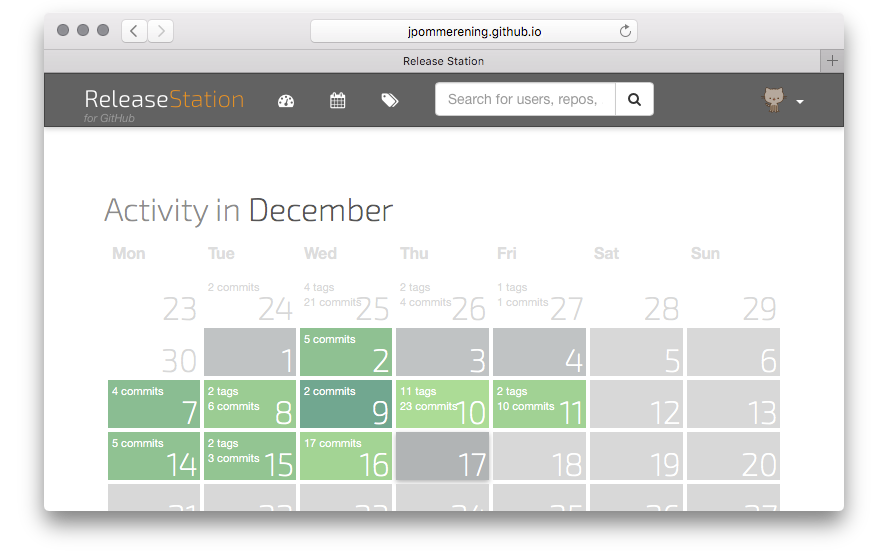

# release-station

> LaxarJS ReleaseStation – all projects, all releases, all in one place



The _ReleaseStation_ is an application for seeing what's happening in your
GitHub repositories.

## System Requirements

For development, you need a reasonably recent version of [Node.js][nodejs] to
install and run the toolchain that bundles the application into a few big
files. Run `node -v` to find out which version your system is running. If the
command reports anything newer than `v0.11.x` you should be ready to go.

Hosting the application itself is very easy. All you need is a webserver that
can serve static files. This may be your trusted Apache, nginx or something
else. You can also [let _GitHub Pages_ do the hosting for you][docs-gh-pages].

If you intend to process a significant amount of GitHub repositories with the
_ReleaseStation_ you might want to run a backend for authenticating with the
[GitHub API][github-api]. The authentication backend might have its own set
of requirements.

## Setup

```console
$ git clone git@github.com/LaxarApps/release-station.git
$ cd release-station
$ npm install
$ npm start
```

## GitHub authentication

This app makes heavy use of the [GitHub API][github-api]. Since GitHub's API is
strongly [rate-limited][rate-limit] for non-authenticated requests, you might
quickly deplete your request quota.

There are two ways you can authenticate with the GitHub API:

- Provide a static API token to your app
- Setup a backend to do the [OAuth2 authentication](oauth-flow) for your app

The first method is easy to implement but leaves your API token out in the open
for anyone to see. Depending on which scopes you assigned to that token (this
app only needs read access to public information), adversaries might wreak
havoc with your GitHub account, or at the very least, abuse the API and get
your token revoked/blocked by GitHub.
In this scenario it is also likely you accidentally commit your token, which
will prompt GitHub to revoke the token once you push it to their servers.

The second method requires a more intricate setup. First, you need a client ID
and client secret to register your application with GitHub. You'll also need a
backend application that serves as a mediator between the release station and
the GitHub API. This backend will have access to the client secret and ID.

For detailed instructions on how to setup authentication, refer to the
[authentication][docs-auth] documentation.

## Architecture


## License

The _ReleaseStation_ is released under the terms of the [MIT license](LICENSE-MIT).

[github-api]: https://developer.github.com/v3 "GitHub API v3"
[rate-limit]: https://developer.github.com/v3/#rate-limiting "Rate Limiting – GitHub API v3"
[oauth-flow]: https://developer.github.com/v3/oauth "OAuth – GitHub API v3"
[nodejs]: https://nodejs.org "Node.js"
[docs-auth]: docs/authentication.md "Authentication – ReleaseStation"
[docs-gh-pages]: docs/github-pages.md "Deploying on GitHub pages – ReleaseStation"
