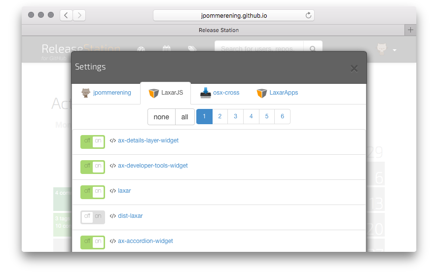

# Pages

This is an overview of the pages in the release station.

## The Grid View: `#/grid/:scope`

The grid view gives an indication on which repositories are currently most
active. It displays one repository per grid-tile and sorts them by activity.
In this context "activity" is an arbitrary combination of recent commits,
created issues, tags, _etc._. Different periods can be considered by selecting
them in the headline.
(The most active repository of last week, may not be at the top of the list,
when activities in the last three months are considered.)

## The Calendar View: `#/calendar/:date`

The calendar view takes a similar approach, but instead of grouping events by
by repository, they are grouped by date.

When entering the page, the calendar displays the current month. Each day of
the calendar lists the events that occured on that specific day. To reveal
details about these events, the user can click on the day, bringing up a
popup window, listing event details in a table, with links to GitHub for more
information.

To navigate between months, the user can click on a day of the next or previous
month, or select a month from the dropdown-menu in the headline.

## The History View: `#/history/:owner/:repo/:version`

## Settings

